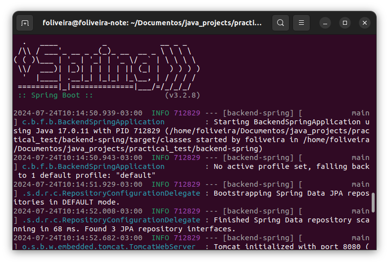
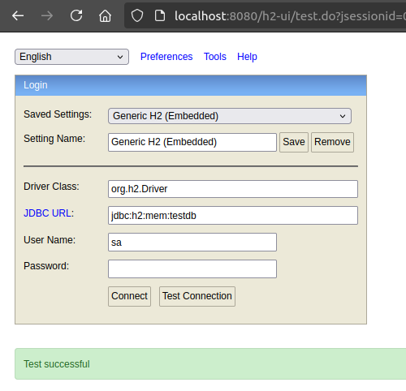
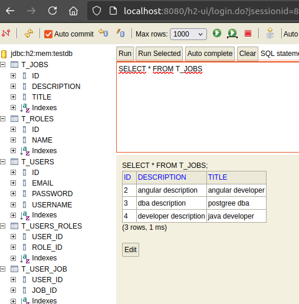
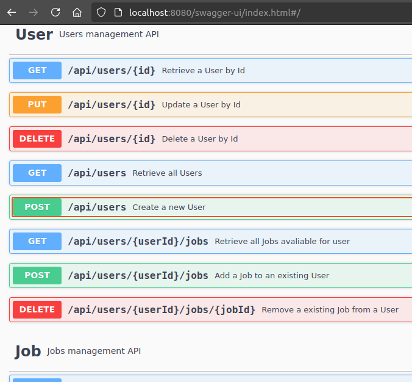
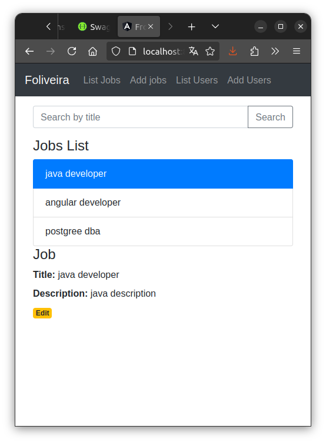
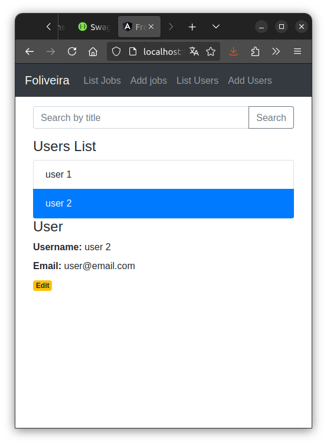

# Aplicação web para o processo de recrutamento interno
Este foi um Desafio Técnico para Desenvolvedor Full Stack. Entretanto não foi possível entregar o produto completo dentro do prazo estipulado. Apesar do tempo e dedicação empregados, houve desafios significativos devido à inexperiência com Angular e autenticação. Desta forma, está sendo entregue o projeto até onde foi possível completá-lo.

Para executar esta aplicação serão necessários:

- Java 17
- Spring Boot 3
- Maven 3.6.3

- Angular CLI 18
- npm 10.7.0
- nodeJS v18.20.4
	
Para simplificação, será utilizado um banco de dados em memória (H2).

## Executando o backend
Abra o terminal no diretório `backend-spring` e digite o comando `mvn spring-boot:run`.

O banco de dados será inicializado e todas as dependências necessárias serão instaladas, após essa etapa a aplicação estará disponível a partir de `localhost:8080`.

Para abrir a interface do banco de dados use a url `localhost:8080/h2-ui`.

Não serão necessárias configurações adicionais, basta clicar no botão `connect` para ter acesso aos schemas.

## Utilizando o Swagger
Digite na barra de endereço do navegador `localhost:8080/swagger-ui/index.html` para interagir com os endopoints da aplicação.

## Executando o frontend
Abra o terminal no diretório `frontend-angular` e digite o comando `npm install`. Após todas as dependências necessárias serem instaladas digite o comando `ng serve --port 8081` e a aplicação estará disponível a partir de `localhost:8081`.

## Endpoits

As duas classes básicas utilizadas na aplicação e armazenadas no banco de dados são `User`(usuário) e `Job`(vaga) e para realizar operações com essas classes foram criados os seguinte endpoints:

- `GET /api/users` retorna uma lista com todos os usuários;
- `GET /api/users/{id}` retorna um usuário através de seu id;
- `GET /api/users/{userId}/jobs` retorna uma lista de vagas disponíveis para o usuário;
- `POST /api/users` cria um novo usuário;
- `POST /api/users/{userId}/jobs` adiciona uma vaga ao usuário;
- `PUT /api/users/{id}` edita um usuário através de seu id;
- `DELETE /api/users/{userId}` deleta um usuário;
- `DELETE /api/users/{userId}/jobs/{jobId}` remove uma vaga de um usuário;

- `GET /api/jobs` retorna uma lista com todas as vagas;
- `GET /api/jobs/{id}` retorna uma vaga através de seu id;
- `POST /api/jobs` cria uma nova vaga;
- `PUT /api/jobs/{id}` edita uma vaga através de seu id;
- `DELETE /api/jobs/{id}` deleta uma vaga;

## Testes unitários
As classes de testes foram incluídas em `src/test/java/com/br/foliveira/backend_spring`.
